# Bulletproof Car Rental Architecture
Proyecto para el diseño de la arquitectura de un software para la renta de vehículos blindados.

## Arquitectura

La arquitectura propuesta cumple con los requisitos para el manejo de transacciones y análisis de los datos que genere la aplicación. Todos los servicios de la app se encontrarán en un único grupo de recuros.

## Servicios a Utilizar para el Despliegue
Se propone utilizar los siguientes servicios de Azure para cumplir con los requisitos de la aplicación:

### App Service Plan
Se debe desplegar un app service plan que contenga dos webapps para el despliegue de la UI y la API.

### Base de Datos en SQL Server con Azure SQL: OLTP y Data Warehouse 
Se propone desplegar un SQL Server como servidor de bases de datos que contenga dos bases de datos: La base de datos transaccional de la app (OLTP) y una base de datos para almacenar registros históricos (Data Warehouse).

Se propone esta solución para mantener el rendimiento en la base de datos transaccional una vez esta tenga cantidad masivas de registros. Estos registros históricos deben de moverse al Data Warehouse  para luego poder ser analizados.

### Proceso de ETL en Batch: Azure Data Factory
Se propone utilizar Azure Data Factory como servicio de batch ETL para el movimiento de los datos de la base OLTP a el Data Lake.

Azure Data Factory ofrece servicios de ETL ya programados y que pueden ejecutarse periódicamente, por lo que los ETL pueden ejecutarse en batch en momentos que la app no tenga una gran cantidad de usuarios activos.

### Data Lake: Blob Storage
Se propone utilizar un Blob Storage como data lake para almacenar los datos históricos y logs, en formato JSON, de la aplicación. 

Almacenar los datos en un data lake permitirá que los datos sean accesibles tanto para su análisis en el Data Warehouse, análisis en Spark y proyectos futuros.

Además, utilizando el almacenamiento en tiers, la solución puede ser más económica.

### Plataforma de Análisis Avanzado: Data Bricks
Databricks debe ser la plataforma de análisis avanzado por su soporte con Apache Spark y notebooks colaborativos, cumpliendo así con los requisitos propuestos para el proyecto. 

Los modelos y resultados generados en databricks se almacenarán en el Data Lake para uso posterior.

### Gestión de Secretos: Azure Data Vault
Utilizar la gestión de secretos de azure permitirá almacenar las claves de los distintos servicios de manera más segura, permitiendo el acceso únicamente a los servicios del sistema.

### Análisis de datos: Power BI
Se propone conectar Power BI con el Data Warehouse para poder poder generar reportes de los datos históricos de la aplicación.

## Despligues
Se presentan las capturas del despliegue de todos los servicios supra mencionados:

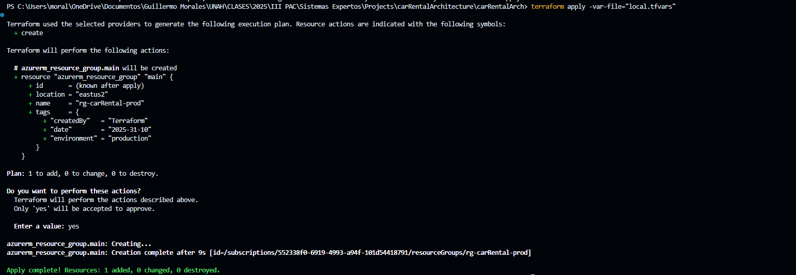
Se desplegó el grupo de recursos rg-carrental-prod para poder agrupar todos los servicios necesarios para el sistema

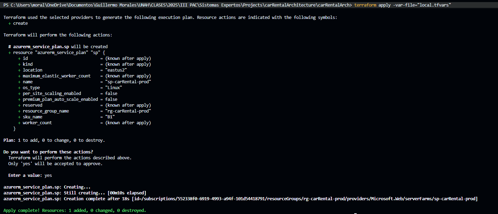
Se desplegó un app service plan para contener las webapps de tanto la UI como el backend de la solución.

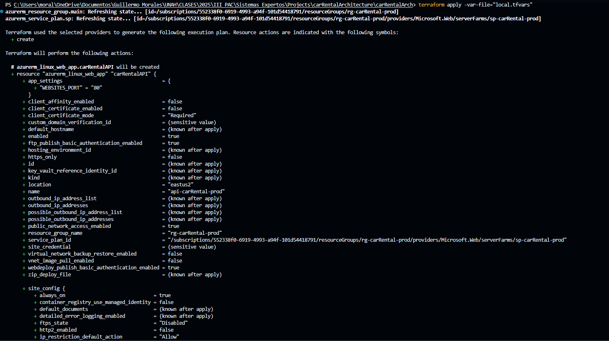
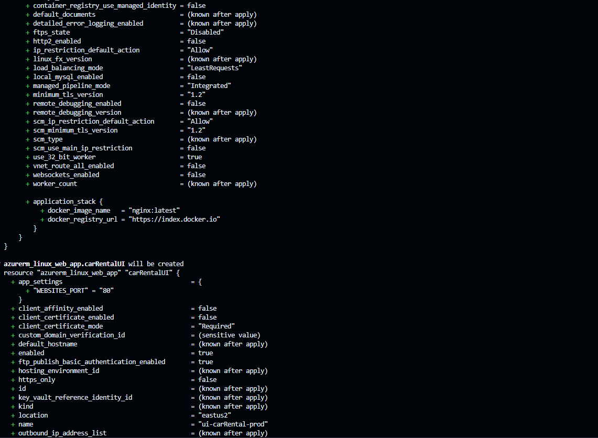
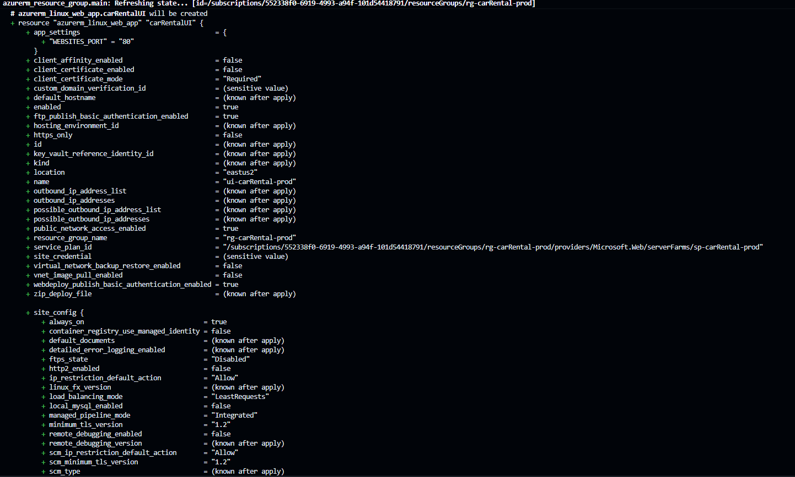
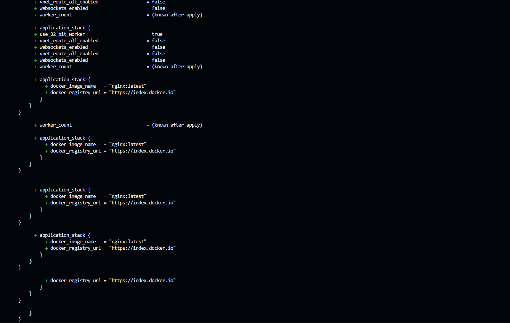
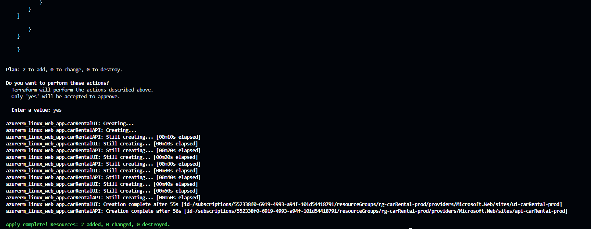
Se desplegaron dos webapps conteniendo una imagen de docker de nginx para el hosting de la UI y la API de la aplicación. Estas web apps se desplegaron en el App Service Plan "sp-carrental-prod"

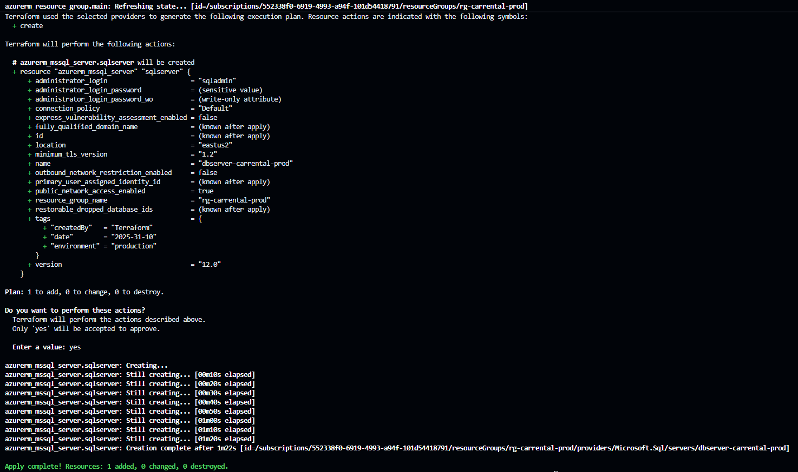
Se desplegó el servidor de Azure SQL para el hosting de las bases de datos OLTP y Data Warehouse del sistema. Se parametrizó la contraseña del usuario principal del servidor. El nombre del servidor es "dbserver-carrental-prod"

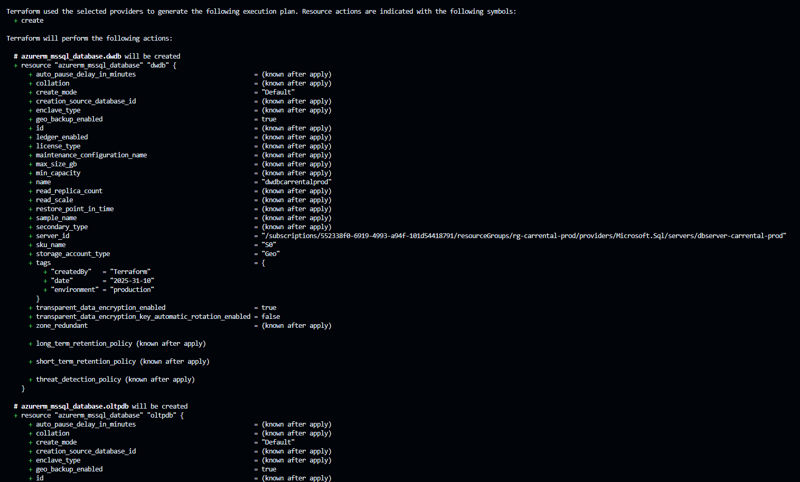
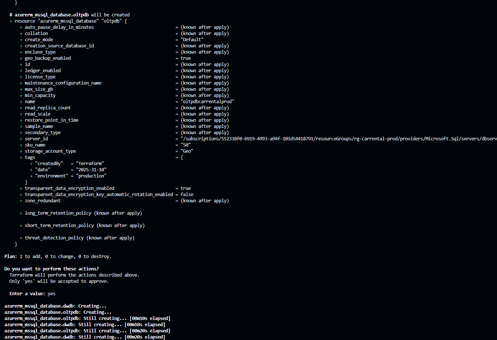
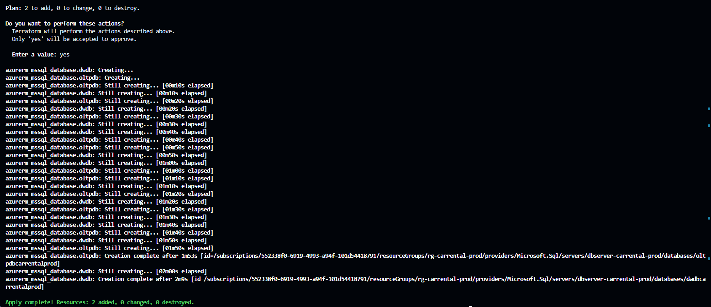
Despliegue de dos bases de datos dentro del servidor de Azure SQL dbserver-carrental-prod, para el OLTP y Data Warehouse del sistema

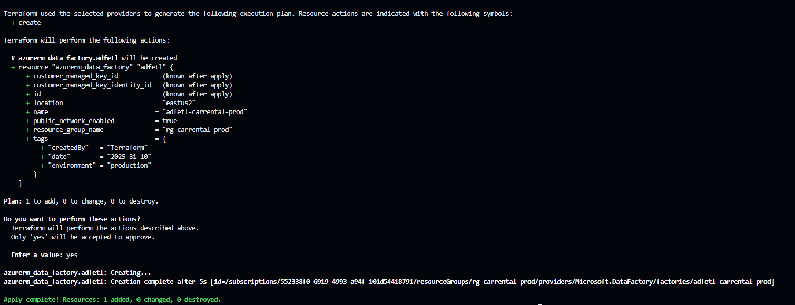
Se desplegó un Azure Data Factory para que este funcionara como orquestrador para la extracción, transformación y carga de datos desde la base de datos OLTP al Data Lake de la solución.

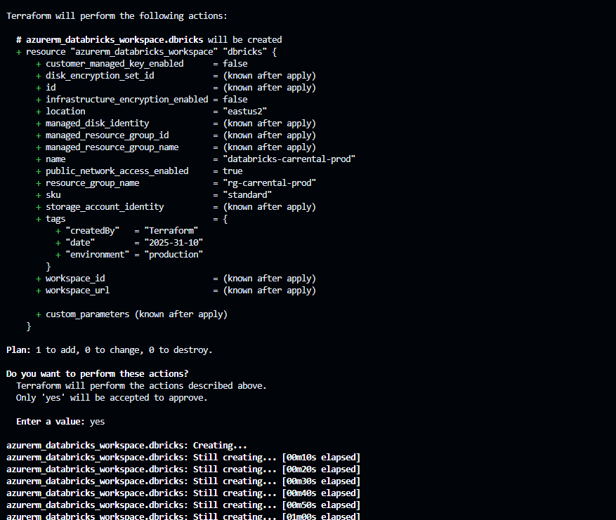
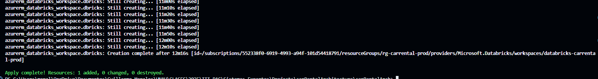
Se desplegó una plataforma de databricks como el espacio colaborativo con notebooks y soporte spark para el análisis y generación de modelos utilizando los datos almacenados en el data lake.

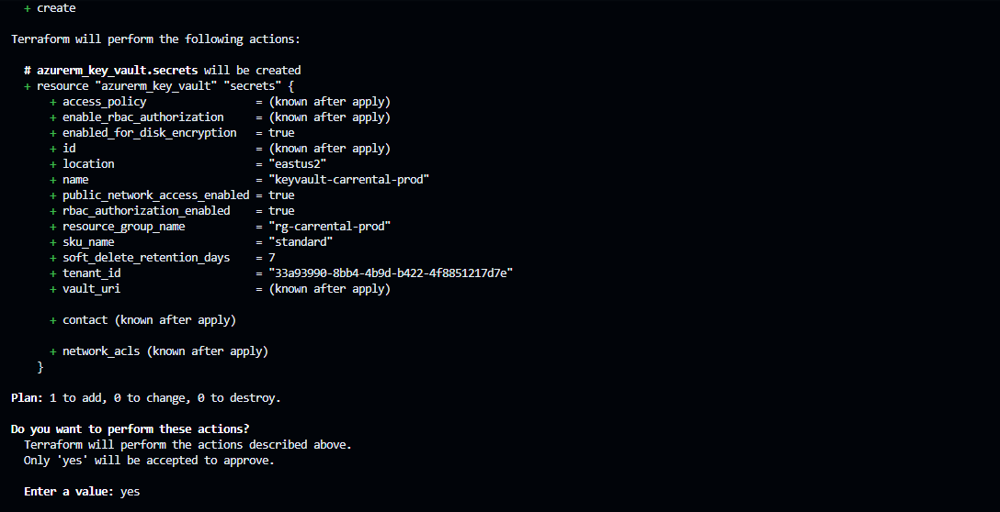
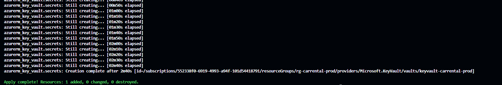
Se desplegó un servicio de Azure Key Vault que fungirá como almacen seguro para los secretos del sistema. Este Key Vault está configurado para utilizar RBAC security para facilitar el proceso de asignar permisos a los diferentes objetos de la arquitectura.

Grupo de recursos con todos los servicios necesarios desplegados.

## Reflexiones Finales
El diseño arquitectónico de una solución es vital para que esta cumpla con todos los requisitos del sistema, su rendimiento sea el óptimo y los costos sean los más eficientes posibles. 

Para este proyecto, se escogieron los recursos pensando si estos verdaeramente aportaban a la solución y si estos cumplían con los requisitos no funcionales del sistema de forma eficaz y eficiente.

Un reto para este proyecto fue la planeación del orden del despliegue de los recursos. Recursos como las bses de datos, el data lake y las web apps, dependen de otros servicios de azure para poder ser desplegadas dentro de estos. 

Otro aspecto notable para esta solución es el remarcar el porque contar tanto con una base de datos OLTP, un data lake y un data warehouse. El separar la data histórica de los datos recientes de la base de datos OLTP permite que el tiempo de ejecución de las consultas sea más rápido. Contar con un data lake permitirá que los datos almacenados puedan utilizarse en muchas otras soluciones futuras cuando escale el sistema. A su vez, contar con un data warehouse permitirá poder realizar análisis de los datos históricos sin acaparar las conexiones a la base de datos OLTP.

El uso de un servicio de orquestación como Azure Data Factory permité la generación de pipelines entre la base de datos OLTP y el data lake; pipelines que pueden ser programados para ejecturse en lotes cada cierto tiempo, sin la necesidad de configurar por nosotros mismos un chronjob para ejecutar un script ETL. A su vez, el escalado de la solución para tener múltiples pipelines entre la base de datos OLTP y otros servicios será más sencillo utilizando Azure Data Factory que programarlo a mano (Menos tiempo y menos errores).

